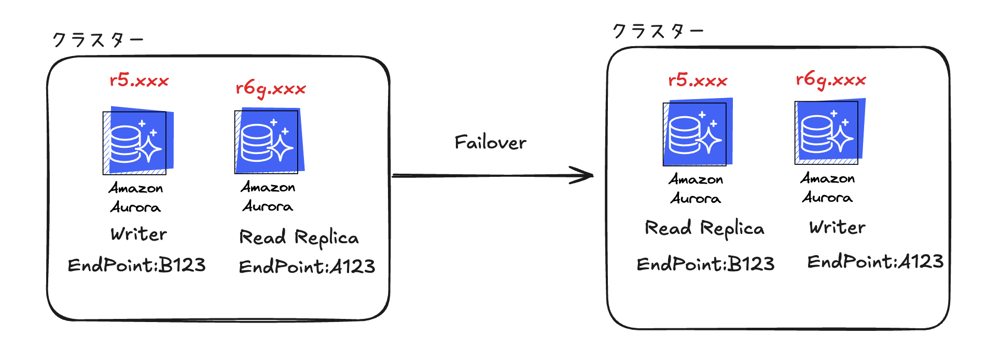

## 배경
회사에서 리저브드 인스턴스 계약을 새로 체결했습니다.  
(r5 패밀리 → r6g 패밀리)  
따라서 기존 r5 패밀리를 사용하는 인스턴스들을 r6g로 변경해야 했습니다.  

## 왜 Failover를 수행했는가?

1. 광고 송출 서비스는 24시간 운영되므로 DB의 다운타임을 최대한 줄이고 싶었습니다.
2. 심야 시간대에는 새로운 데이터 쓰기가 없었습니다.  
   따라서 레플리케이션 걱정 없이 안전하게 데이터 동기화를 보장할 수 있었습니다.

## 사전 주의사항 ⚠️

- **Read Replica의 Failover를 수행하면 Writer 인스턴스의 엔드포인트가 변경됩니다.**  
    - 애플리케이션이 클러스터의 Writer 인스턴스 엔드포인트를 바라보도록 설정되어 있는지 확인하세요.
- **Read Replica가 최종적으로 Writer 인스턴스가 됩니다.**  
    - 데이터가 완전히 동기화되지 않았을 가능성이 있습니다.  
      `Replication Lag` 등을 확인하여 데이터 동기화 상태를 점검하세요.
- **Failover 중에는 다운타임이 발생할 수 있습니다.**  
    - 약 **1~2분** 정도 예상됩니다.

## 작업 절차

1. **Read Replica 생성**  
   변경하고 싶은 인스턴스 타입으로 Read Replica를 생성합니다.

2. **데이터 동기화 확인**  
   Read Replica가 최신 데이터를 보유하고 있는지 확인합니다.  
   이를 확인하지 않으면 Failover 이후 데이터 불일치가 발생할 수 있습니다 ⚠️

3. **Failover 실행**  
   Read Replica를 Writer 인스턴스로 승격시켜 Failover를 수행합니다.

4. **Connection Pool 재설정**  
   Connection Pool을 사용하고 있었으므로 연결을 다시 설정하는 작업을 수행했습니다.

5. **새 Writer 인스턴스 모니터링**  
   쓰기 테스트를 실행하여 데이터가 정상적으로 기록되는지 확인했습니다.

6. **이전 Writer(새로운 Read) 인스턴스 삭제**  
   기존 Reader 인스턴스는 사용하지 않는 DB였으므로 비용 절감을 위해 삭제했습니다.

**작업 완료!**
